# oss的代码规范

为了避免合作者使用不同代码格式造成混乱, 使代码在版本控制上的diff保持干净, 我们要求所有合作者使用同样的代码格式.  
因为代码量比较大, 很难使用人力维护格式, 我们使用工具来进行代码格式化和格式检查.  
我们使用的工具在IntelliJ和Eclipse上都有相应的插件, 能满足绝大多数开发者的需求.  
格式检查已经在oss父pom中定义好了,  开发者只需在自己的工作站上设置好IDE插件, 并导入oss给出的配置文件.  
 

本文主要解决开发者如何设置本地开发环境的问题。开发者本地开发环境的设置要与oss父pom中maven插件的设置相匹配，
这样才能保证本地检查通过的代码，在构建(CI)时也能通过检查。 oss父pom使用的checkstyle, pmd等配置文件在
`oss/src/main`里面。开发者安装IDE插件后需要设置插件使用同一套配置文件。CI构建时我们通过http访问oss项目
中的配置文件，以做到配置集中控制，统一修改。

## git设置  

### 全局禁止git自动替换换行符  

    git config --global core.autocrlf false

### 检查git设置

    git config --list

### 项目级别的git设置  

执行命令  

    git config --local core.autocrlf false
    git config --local core.filemode true
    git config --local core.ignorecase false
    git config --local core.quotepath false
    git config --local core.safecrlf true
    git config --local user.name "someone"
    git config --local user.email "someone@yirendai.com"

或编辑.git/config  

    [core]
        ignorecase = false
        quotepath = false
        filemode = true
        autocrlf = false
        safecrlf = true
    [user]
        name = someone
        email = someone@yirendai.com

## 代码风格标准  
[Java代码风格](https://google.github.io/styleguide/javaguide.html)  
[Python代码风格](https://google.github.io/styleguide/pyguide.html)  
[Shell代码风格](https://google.github.io/styleguide/shell.xml)  

## Web 代码风格  
[Javascript代码风格](https://google.github.io/styleguide/javascriptguide.xml)  
[AngularJS代码风格](https://google.github.io/styleguide/angularjs-google-style.html)  
[HTML/CSS代码风格](https://google.github.io/styleguide/htmlcssguide.xml)  

## Eclipse 代码风格设置  
导入src/main/eclipse/google-style-java-eclipse*.xml配置文件  
Preferences -> Java -> Code Style -> Formatter -> Import  
此文件来自[google style](https://raw.githubusercontent.com/google/styleguide/gh-pages/eclipse-java-google-style.xml)并进行过简单修改  

安装[editorconfig](https://github.com/ncjones/editorconfig-eclipse#readme)插件  
安装[checkstyle](https://sourceforge.net/projects/eclipse-cs/)插件并导入src/main/checkstyle下对应版本的配置文件  
安装eclipse-pmd(注意不是pmd-eclipse)插件[eclipse-pmd repository](http://acanda.github.io/eclipse-pmd/)  
安装[findbugs](https://github.com/findbugsproject/findbugs/releases)插件  
安装JDepend4Eclipse  
安装EclEmma (jacoco测试覆盖度) [EclEmma使用方法](http://www.eclemma.org/)  
[使用EclEmma进行覆盖测试](http://www.ibm.com/developerworks/cn/java/j-lo-eclemma/index.html)  

## IntelliJ 代码风格设置  
导入src/main/intellij/google-style-java-intellij*.xml配置文件  
Preferences -> Plugins -> Editor -> Code Style -> Manage -> Import -> Intellij IDEA code style XML  
此文件来自[google style](https://raw.githubusercontent.com/google/styleguide/gh-pages/intellij-java-google-style.xml)并进行过简单修改  

CheckStyle-IDEA插件
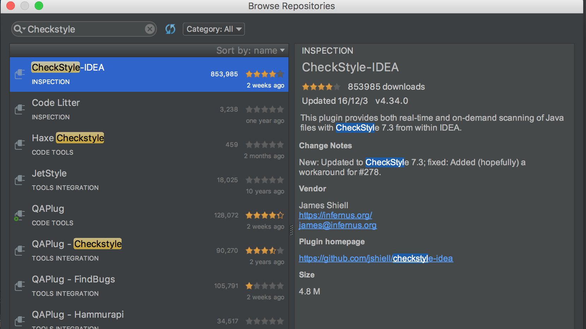
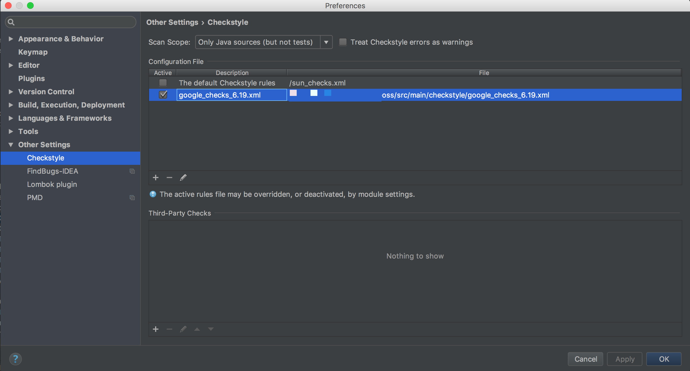
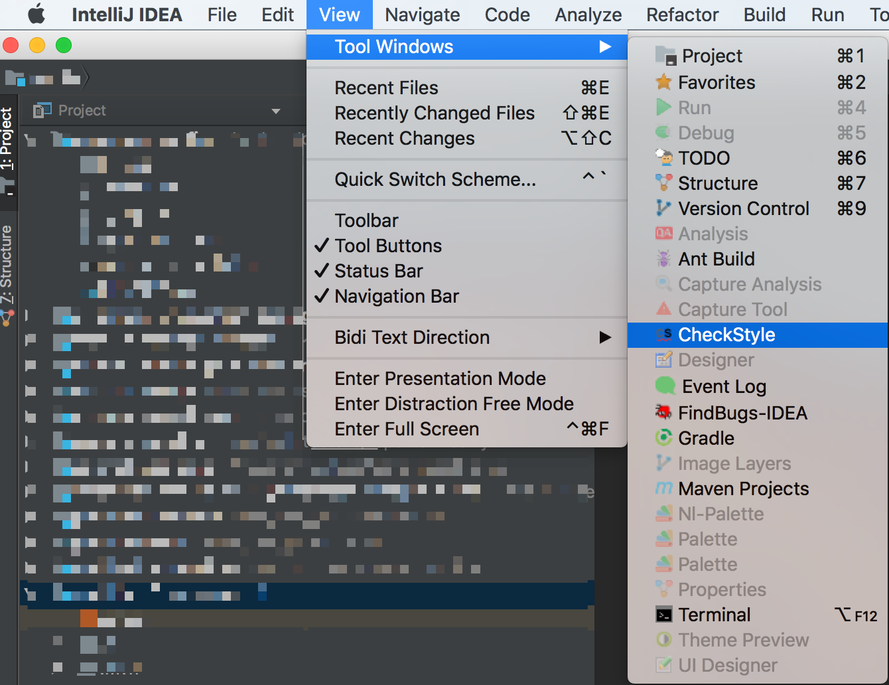
FindBugs-IDEA插件
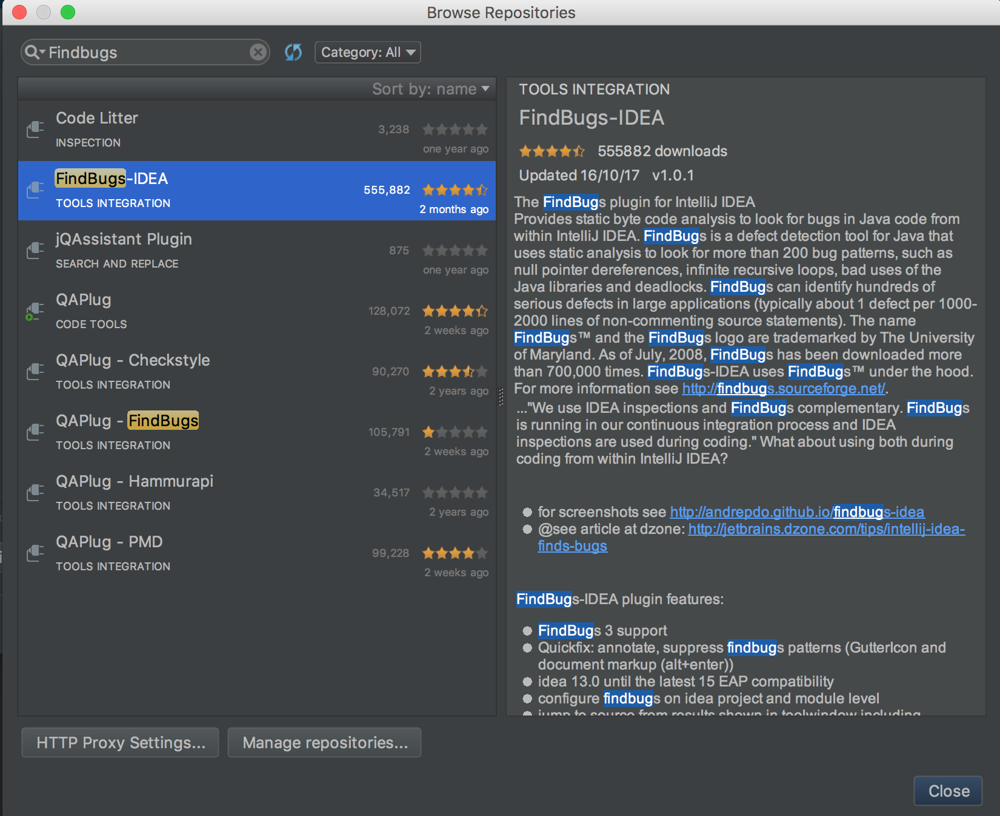
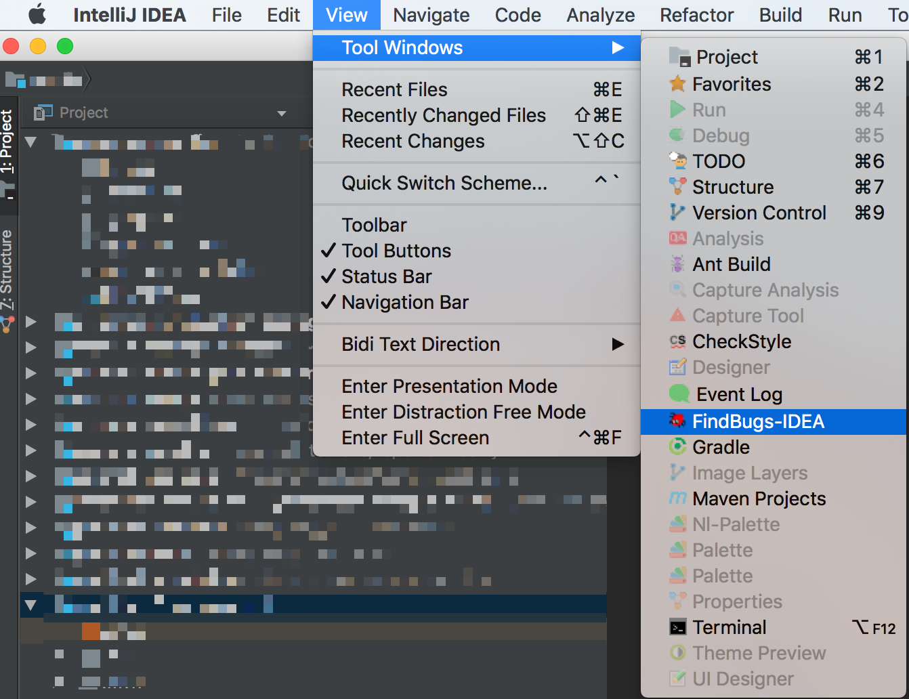
PMDPlugin插件评价不高
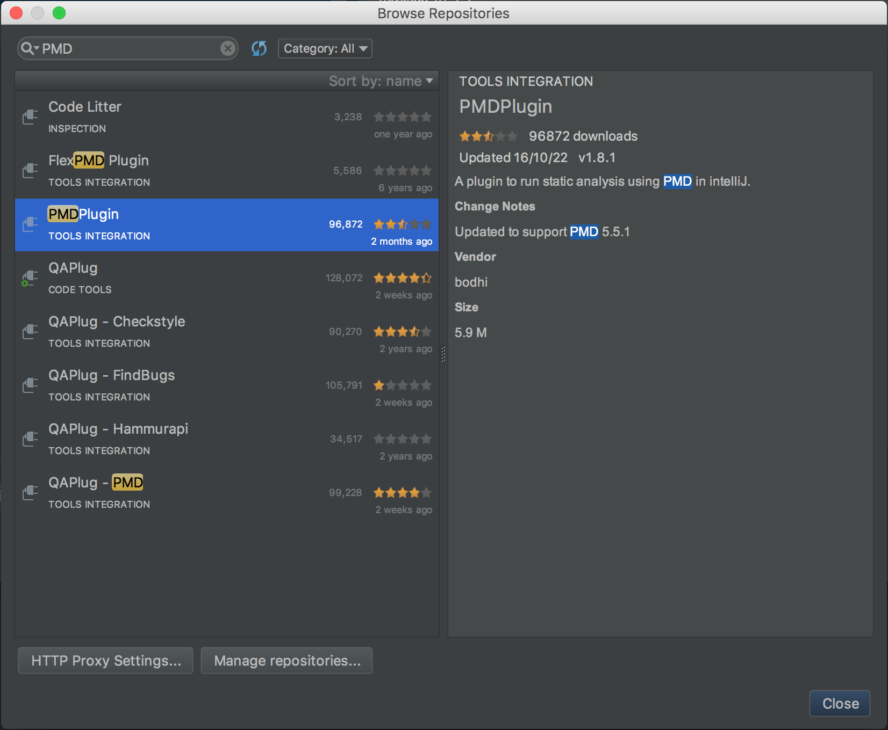
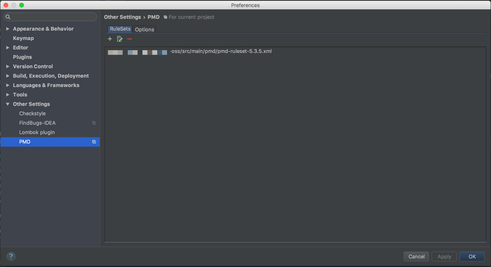
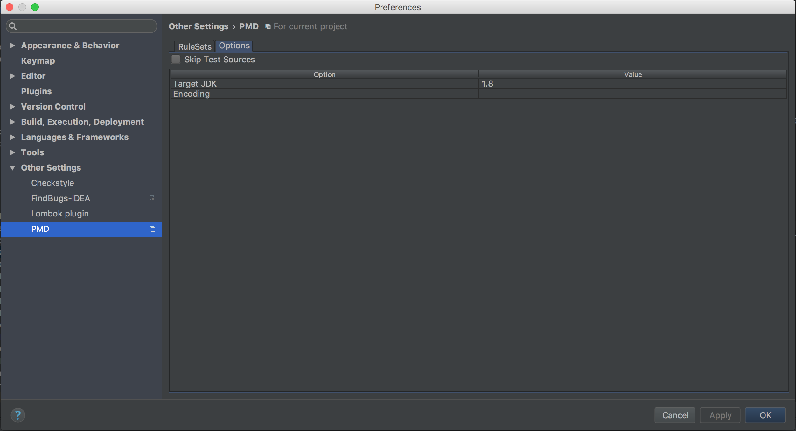
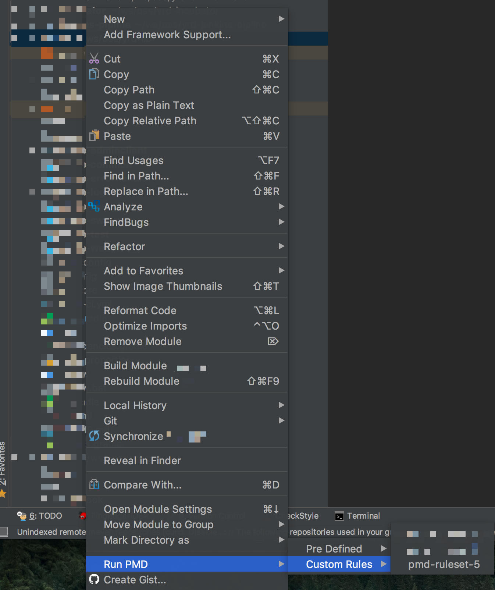
无JDepend插件
~~确认 EditorConfig 插件已安装且启用 (2016.2 build-in?)~~  
~~安装 eclipse code formatter 插件  Preferences -> Plugins -> Browse Repositories -> Search 'eclipse code formatter' -> Install~~  

## Eclipse import 调整 (与IntelliJ兼容)  
导入src/main/eclipse/google-style-java-eclipse*.importorder配置文件  
Preferences -> Java -> Code Style -> Organize Imports -> Import  

set "class count to use import with '*'" to 99 (seems like you cannot turn this off)  

## IntelliJ import 调整  
Preferences -> Editor -> Code Style --> Java --> Imports (tab) -> Import Layout  

## Eclipse 代码风格工具简单使用
安装代码风格插件以后, 有些需要手工启用, 简单介绍如下:
#### google style代码风格
google style导入以后, 一般能够直接使用, 可以格式化一个文件试试, 代码缩进为2个空格. 要将整个项目进行格式化, 则需要在 **package explorer** 视图下, 选中项目(可同时选中多个), 点击"Source"菜单, 选择"format".    

如果第一次导入不能使用, 那么先手动切换回原来style, 再切换回来就可以了.

#### editorconfig 插件
EditorConfig 用来定义代码格式，以实现不同编辑器、不同项目成员之间统一代码风格. 详情: [editorconfig](https://github.com/ncjones/editorconfig-eclipse#readme)

#### checkstyle 插件
代码检查工具. 开启方式: 右键项目(可以选中多个) -> checkstyle -> active checkstyle. 在problems标签下就能看到相应警告.
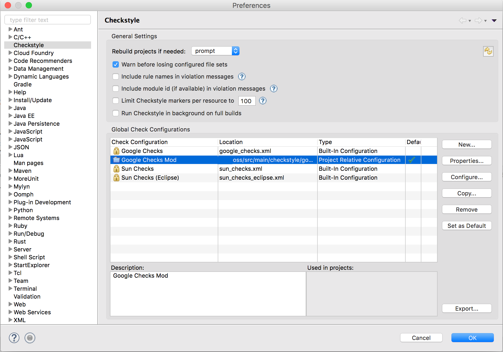

#### eclipse-pmd 插件
源码分析器, 检查Java源文件中的潜在问题. 这个需要手工对每一个项目启用. 右键项目 -> properties -> pmd -> 启用. 然后在select rule set里面, 点击add -> file system, 找到yirendai-parent/src/main/pmd/pmd-ruleset.xml并启用. 启用以后, 就能在problems标签看到警告.

如果没反应, 先取消启用, 再重新启用一下就好.
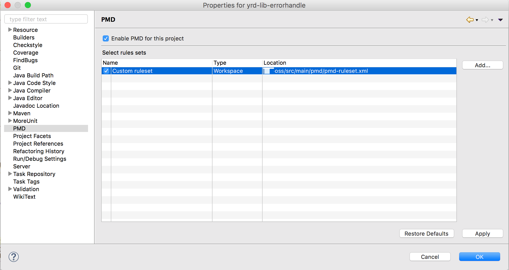

#### findbugs 插件
右键项目(可选中多个) -> findbugs -> findbugs, 结果在 problems标签下查看.

#### JDepend4Eclipse 插件
生成Java包的质量评价报告. 选择src文件夹，然后点击右键，然后点击run JDepend analysis.

#### EclEmma 插件
代码覆盖度插件.
