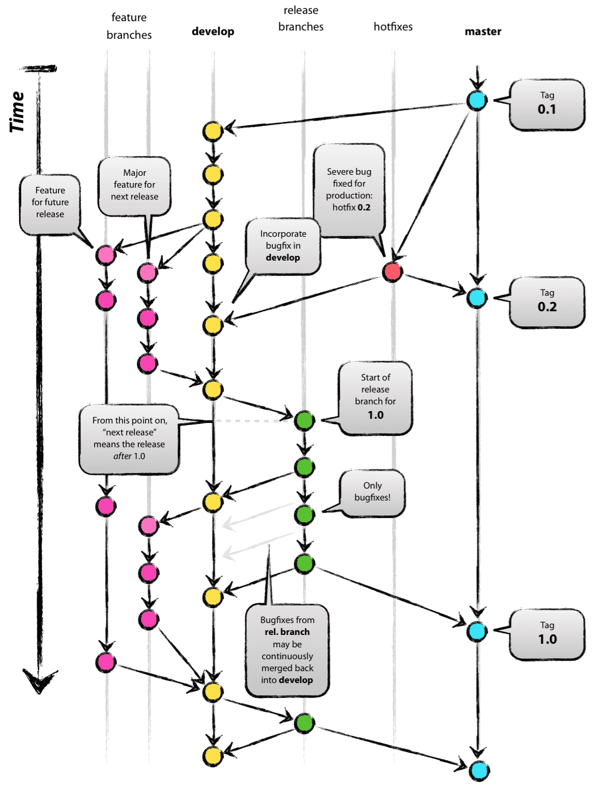

# 使用分支模型为项目加速

## Gitflow分支模型
> 项目选定了gitflow的分支模型，详细可参考[A successful git branching model](http://nvie.com/posts/a-successful-git-branching-model/)




## 发布版本(release)

### maven项目发布
> 为了更好的使用git-flow管理分支模型，这里使用了一款gitflow的maven插件来进行项目的发布和部署

1. 本地develop分支上执行 `mvn gitflow:release-start`, 新建release分支。注意这里版本号要指定，目前支持的是形如 1.0.8.OSS 格式的版本号,参考[semantic versioning](http://semver.org/)，新开分支后，检查全部文件的版本号，是否生效(主要检查相关文档的版本号，需要手工修改，全部替换为当前要发的版本号:1.0.8.OSS);
2. 将release分支push到远端，`git push -u origin release/1.0.8.OSS`，触发travis-ci的发布操作,publish到nexus仓库,以及发布maven-site到github-pages。(release到nexus仓库发布仅在release分支上触发，其他分支屏蔽；这里如果第一次发布成功了，再次重发，需要修改版本号重复执行步骤1)。
3. nexus发布成功后，证明此次release代码OK。本地执行`mvn gitflow:release-finish`.本地的release分支会被删除，并打出tag，
4. push tag到远端 `git push origin tag_name`，触发tag的发布，tag不做nexus的发布操作，只做test_and_build 和uploading release的产物，如工具类的jar到github。push之后，在github会产生一个release。
5. tag发布完毕后，再回到本地，进行善后清理操作，将develop和master的提交，推到远端，release分支的删除操作，也推到远端。

操作样例:

    mvn gitflow:release-start # 如maven版本号确定为1.0.8.OSS
    git push -u origin release/1.0.8.OSS # 推送远端触发nexus发布
    mvn gitflow:release-finish
    git push origin v1.0.8.OSS
    git push origin develop
    git push origin master


### 其他项目发布
> 以上发布流程，覆盖maven项目的构建发布，如果项目不是maven项目，则可通过`git flow` ([git-flow安装使用教程](https://sealake.net/index.php/archives/7/))来做项目的发布操作。包括后面的hotfix以及feature开发，都用到了git flow

1. `git flow release start v1.0.8` 新开发布分支
2. `git push -u origin release/v1.0.8` 推送到远端
3. `git flow release finish -m "release" v1.0.8` 注意-m后的注释不能带空格，参见[Release tag message flag](https://github.com/nvie/gitflow/issues/50)
4. `git push origin v1.0.8` 将tag推送到远端
5. 进入github进行手工发布,如[release](https://github.com/home1-oss/oss-build/releases),`Draft a new release`,选定tag版本发布即可。

-------

### Travis发布
> 通过travis ci再项目构建完毕后，发布产物到github的release页面，用户可以通过release来直接获取项目的构建产物。

#### 相关配置

    # v is refered to gitflow-maven-plugin:versionTagPrefix
    before_deploy:
      - export PROJECT_MAVEN_VERSION=${TRAVIS_TAG/v/}

    deploy:
      provider: releases
      api_key: $GITHUB_INFRASTRUCTURE_CONF_GIT_TOKEN
      file: "target/oss-configlint-${PROJECT_MAVEN_VERSION}.jar"
      skip_cleanup: true
      on:
        tags: true

    after_deploy:
      - echo "deploy finished!"

- 确保 `skip_cleanup: true` ,否则travis CI会删除构建产物
- 加密token有两种方式，一种是在setting界面来配置token，一种是指定secure的token: `api_key:
        secure: XXXXXXX`
- 如果想用通配符指定多个目录，需要增加 `file_glob: true` ,然后`file: dir1/*`
- 使用 `before_deploy` 和 `after_deploy`来扩展deploy的前后的准备和清理工作
- 定制deploy条件，可参照下面的内容。
- 将本地的项目tag版本推送到远端，执行 `git push origin tag_name`会触发一次travis ci的构建；或者在github的release标签页，标记tag，然后发布release。

#### 触发条件配置


+ `repo` 描述仓库的区块:(owner_name/repo_name,e.g,test/hello-world)
+ `branch` 分支的名称，如果不指定，默认是app- 或者是master分支。若不确定哪些分支可以做release操作，可以指定`all_branch:true`实现 `branch: **`，可以同时和其他条件配合使用
+ `jdk, node, perl, php, python, ruby, scala, go` 用来指定不同语言的多版本。
+ `condition`用来设定bash的条件，必须是一个字符串，会被传递到bash的表达式，形如：`if [[ <condition> ]]; then <deploy>; fi`,条件可以很复杂，但是只能有一个条件。如`$CC = gcc`
+ `tags` 当指定为true，将会在一个tag被应用到提交时触发deploy，这会导致`branch`条件被忽略，

-------


### NOTES
- 对于oss-build和oss-github，发布release版本要注意，如果oss-github有更新，需要先发布oss-github，然后修改项目里的文件travis配置文件:`.travis.yml`定义环境变量`OSS_BUILD_CONFIG_REF_BRANCH=v1.0.8`环境变量.

         env:
          global:
            - OSS_BUILD_CONFIG_REF_BRANCH=v1.0.8

- 项目选择oss-build ci-script/ci.sh脚本的版本号，需要手工配置
    > 默认引用的oss-build以及oss-github的版本号是develop,如需定制，加入如下全局环境变量即可

        env:
          global:
            - OSS_BUILD_REF_BRANCH=v1.0.8

- 确保全部测试通过, 否则无法release-finish
- 发布的tag，在现有版本的基础上会增加前缀:v，maven插件配置可通过：

        <gitFlowConfig>
            <versionTagPrefix>v</versionTagPrefix>
        </gitFlowConfig>

  而git-flow命令插件，可通过 .git/config 文件来配置：

        [gitflow "prefix"]
            versiontag = v


## 紧急修复一个bug(hotfix)

### maven项目
1. 确保没有未提交的修改,从master分支创建hotfix分支 `mvn gitflow:hotfix-start`, 检查所有出现版本号的位置是否被正确修改,进入开发。
2. 将hotfix推送到远端，保存分支 `git push origin branch_name`
3. 完成开发 `mvn gitflow:hotfix-finish`,过程可能发生冲突，建议通过merge或者rebase先做一次分支合并。
4. 将master和develop的分支推送到远端。
5. 如果需要发布，则参照上文进行发布

操作样例:

    mvn gitflow:hotfix-start # 确定分支版本，如1.0.8.OSS
    git push origin hotfix/1.0.8.OSS
    mvn gitflow:hotfix-finish
    git push origin develop
    git push origin master

### 非maven项目

1. `git flow hotfix start 1.0.8.OSS master`
2. `git push origin hotfix/1.0.8.OSS`
3. `git flow hotfix finish 1.0.11.OSS`
4. `git push origin v1.0.11.OSS` git flow 会自动打出一个tag
5. `git push origin develop`
6. `git push origin master`

## 开发一个新功能(feature)

### maven项目
 从develop分支创建feature分支, 使用之前的版本号更新pom(s), 可选择更新或不更新版本号, 默认使用feature名字更新版本号更新pom(s)

    # 确保没有未提交的修改
    mvn gitflow:feature-start
    # 输入feature名称
    # 检查所有出现版本号的位置是否被正确修改
    # 进行开发
    # 提交所有未提交的修改

将feature分支merge到develop分支, 使用之前的版本号更新pom(s), 删除feature分支

    mvn gitflow:feature-finish
    # 选择要完成的feature名称(可以同时有多个feature)
    # 检查所有出现版本号的位置是否被正确修改
    git push origin develop:develop
    # 可选的 触发ci发布新版本
### 非maven项目

1. `git flow feature start new_feature`
2. `git push origin feature/new_feature`
3. `git flow feature finish`
4. `git push origin develop`

## GPG签名 on Travis CI

see: http://www.debonair.io/post/maven-cd/

```bash
passphrase="passphrase"

cat > maven_gpg_key_with_default_algorithms <<EOF
%echo Generating a default key
Key-Type: default
Subkey-Type: default
Name-Real: home1.cn
Name-Comment: with passphrase
Name-Email: opensource@home1.cn
Expire-Date: 0
Passphrase: ${passphrase}
%pubring home1_cn_maven_gpg_key.pub
%secring home1_cn_maven_gpg_key.sec
# Do a commit here, so that we can later print "done" :-)
%commit
%echo done
EOF
```
    
    gpg2 --batch --gen-key maven_gpg_key_with_default_algorithms
    gpg --allow-secret-key-import --import ./home1_cn_maven_gpg_key.sec
    gpg --import ./home1_cn_maven_gpg_key.pub

List public keys:

    gpg --list-keys

List private keys:

    gpg --list-secret-keys
    gpg --list-secret-keys --keyid-format LONG

Submit key to the ubuntu server with

    # key id: 2048R/<keyid> or 4096R/<keyid>
    gpg --send-keys --keyserver keyserver.ubuntu.com $keyid

Submit your key to the MIT server with

    gpg --send-keys --keyserver pgp.mit.edu $keyid

And once more just to be sure

    gpg --send-keys --keyserver pool.sks-keyservers.net $keyid

Put following content into ~/.m2/settings.xml

    <servers>
        <server>
            <id>gpg.passphrase</id>
            <passphrase>${env.GPG_PASSPHRASE}</passphrase>
        </server>
    </servers>
    <profile>
        <activation>
            <activeByDefault>true</activeByDefault>
        </activation>
        <properties>
            <gpg.keyname>${env.GPG_KEYNAME}</gpg.keyname>
        </properties>
    </profile>

Export and backup keys

    gpg --export --armor opensource@home1.cn > home1_cn_maven_gpg_key.asc
    gpg --export-secret-keys --armor opensource@home1.cn >> home1_cn_maven_gpg_key.asc

Now put home1_cn_maven_gpg_key.asc somewhere very safe and destroy the file (use `shred --remove home1_cn_maven_gpg_key.asc` for destruction)

Export sub-keys `gpg --export-secret-subkeys opensource@home1.cn > subkeys`

Remove master keys `gpg --delete-secret-key opensource@home1.cn`

Change passphrase

    gpg --edit-key opensource@home1.cn
    passwd
    save

Encrypt cert and variables for travis

  see: https://github.com/travis-ci/travis.rb#installation
  Make sure you have at least Ruby 1.9.3 (2.0.0 recommended) installed.
  
    ruby -v
  
  Updating your Ruby

    brew install ruby
    gem update --system

  Install travis cli

    gem install travis -v 1.8.8 --no-rdoc --no-ri
    travis version

  `travis login` or `travis login --github-token $GITHUB_INFRASTRUCTURE_CONF_GIT_TOKEN`

  Make sure your working directory is the git root of your project.

    gpg --export --armor opensource@home1.cn > codesigning.asc
    gpg --export-secret-keys --armor opensource@home1.cn >> codesigning.asc
    
  Encrypt the keys `travis encrypt-file codesigning.asc`
  Take note of the line that looks like: openssl aes-256-cbc -K...
  Shred the un-encrypted keys `shred --remove codesigning.asc`
  Make sure to move the created file to: cd/codesigning.asc.enc

set GPG_KEYNAME and GPG_PASSPHRASE environment variables in travis

## 参考资料
- [Deployment](https://docs.travis-ci.com/user/deployment#Conditional-Releases-with-on%3A)
- [GitHub Releases Uploading](https://docs.travis-ci.com/user/deployment/releases/)
- [painless-maven-project-releases-with-maven-gitflow-plugin](http://george-stathis.com/2013/11/09/painless-maven-project-releases-with-maven-gitflow-plugin/)
- [maven-git-flow-plugin-for-better-releases](http://blogs.atlassian.com/2013/05/maven-git-flow-plugin-for-better-releases/)
- [conflict-free-git-trees](https://stanfy.com/blog/conflict-free-git-trees-part-1/)
- [maven的gitflow插件](https://github.com/KimJejun/gitflow-maven-plugin)
- [git flow安装使用](https://sealake.net/index.php/archives/7/)
- [a successful git branching model](http://nvie.com/posts/a-successful-git-branching-model/)


