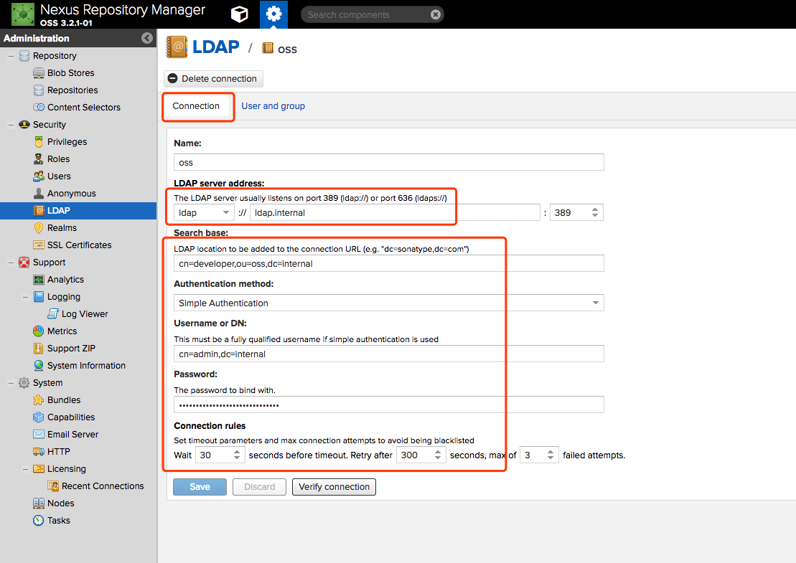
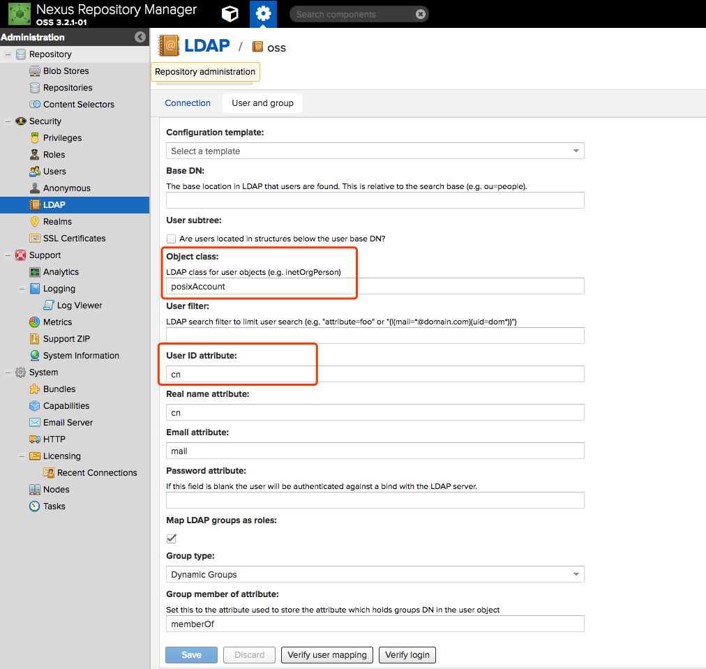

# nexus3搭建

## 设置DNS解析

该系统涉及域名如下

        nexus.internal
        mirror.docker.internal
        registry.docker.internal
        fileserver.inernal

## 搭建步骤

### 获取github代码

    git clone git@github.com:home1-oss/docker-nexus3.git

### 构建镜像

    cd docker-nexus3
    . ./nexus3.sh # 默认是执行构建镜像
    docker network create oss-network
    docker-compose up -d #注意，nexus3.sh默认是构建镜像，需要在构建成功后单独执行

## 检查服务
访问 [http://nexus.internal/nexus/](http://nexus.internal/nexus/)来查看服务是否搭建成功

## 参考资料
- [http://www.linuxidc.com/Linux/2013-06/85694.htm](http://www.linuxidc.com/Linux/2013-06/85694.htm)

## nexus3 ldap配置

1. 连接配置

2. 用户与组的配置

3. 若配置时，提示域名访问不了，请检查dns配置，尝试进入docker容器修改dns
